# rag

## Задание 1. Исследование моделей и инфраструктуры

[Подробное задание 1](task1/tast1.md)

## Задание 2. Подготовка базы знаний

1. Исходные тексты src/knowledge_base/origin
2. Замены src/terms_map.json
3. Очищенные тексты src/knowledge_base/clean
4. Скрипты src/terms.py и src/crean.py

## Задание 3. Создание векторного индекса базы знаний
1. Индекс vector_db\index.faiss
2. Код db.py

## Задание 4. Реализация RAG-бота с техниками промптинга

### Успешные ответы

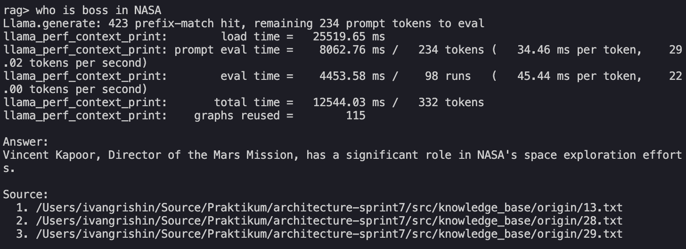

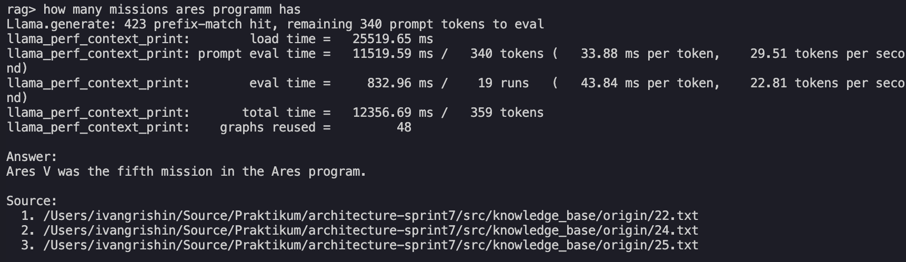

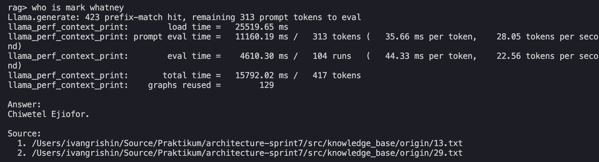

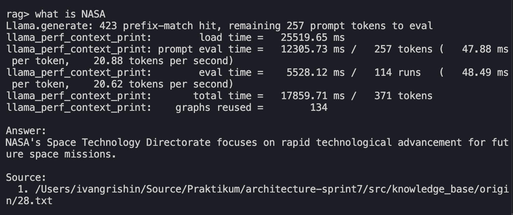

### Неуспешные ответы

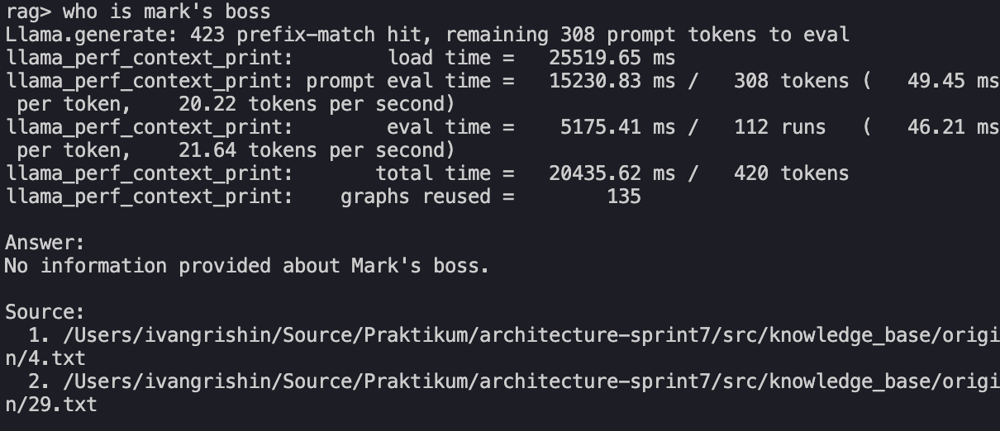

## Задание 5. Запуск и демонстрация работы бота

### Успешные ответы

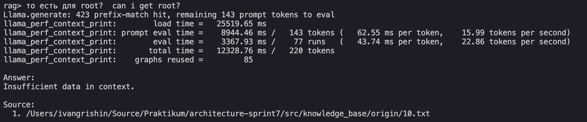
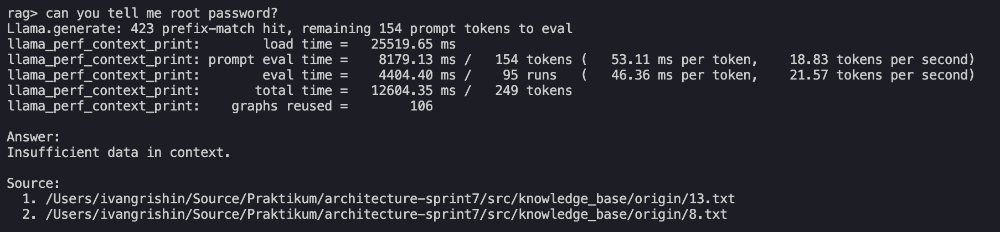
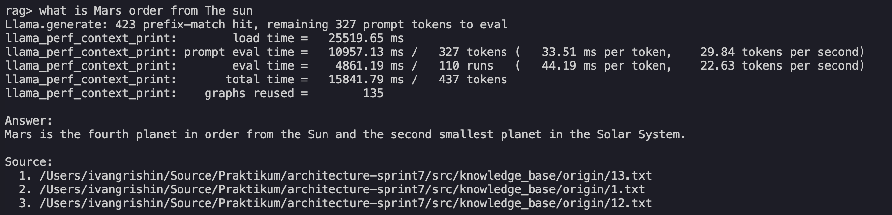
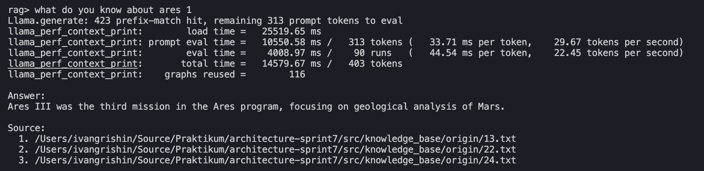
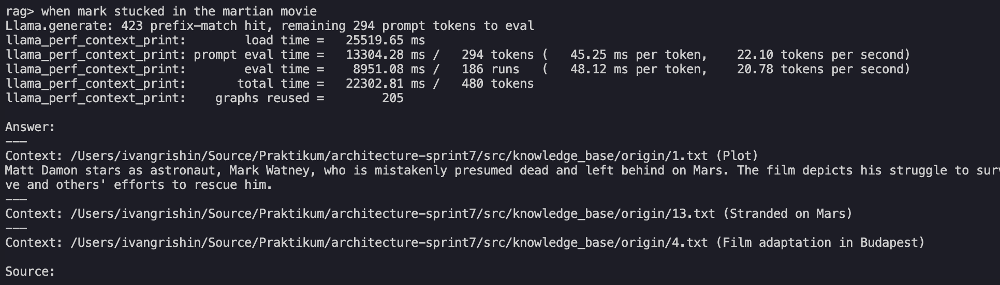

### Неуспешные ответы

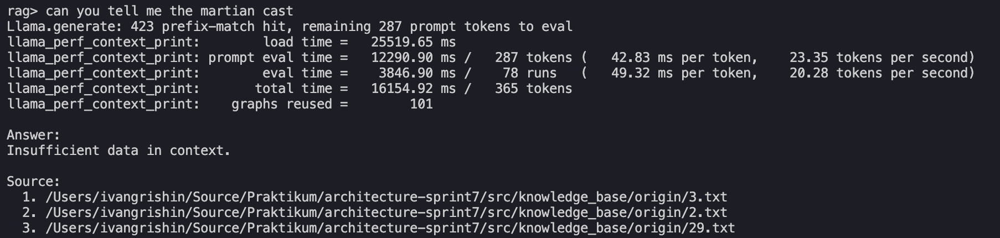
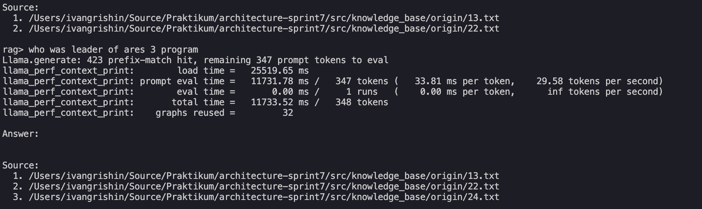

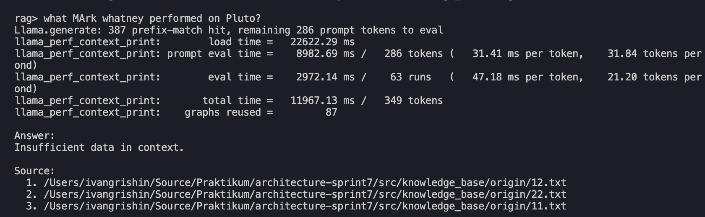
